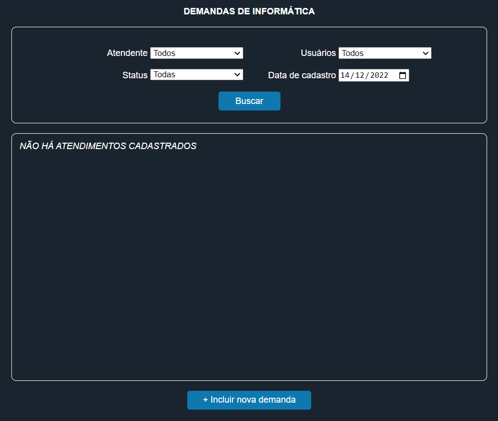
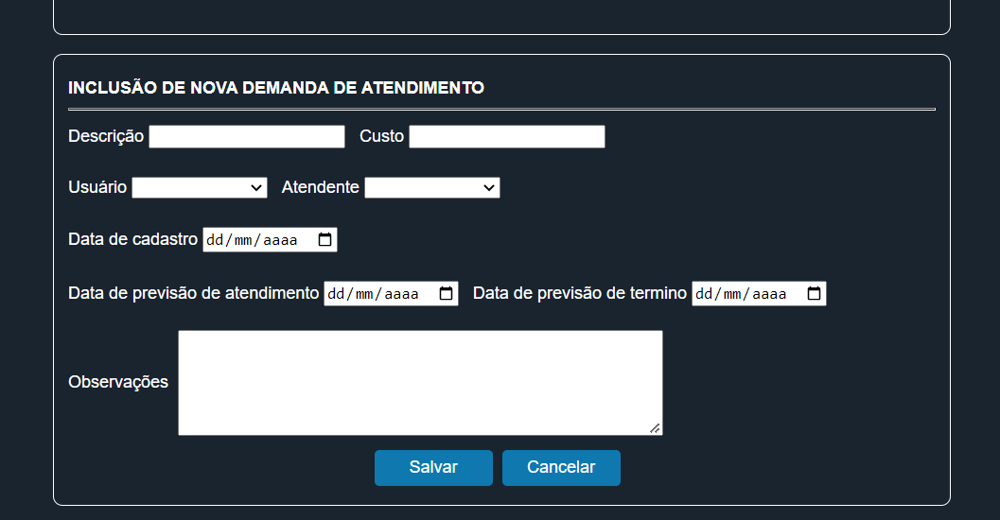
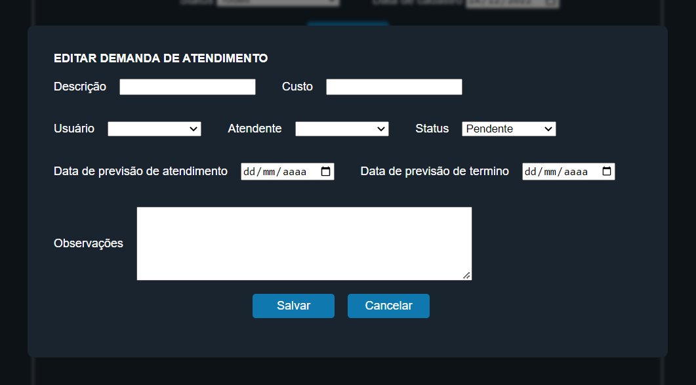

# Controle de demandas de informática
Sistema para gerenciamento de demandas de informática!
- O sistema inclui, edita, exclui e pesquisa demandas.

Tecnologias:

  

 

<h3>Início</h3>

 

<h3>Seção de inclusão de demandas</h3>

 

<h3>Tela de edição da demanda</h3>

